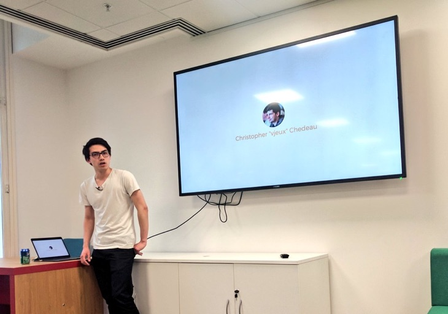

### Hiya 👋

I'm Phil and obsessed with tinkering on tools & projects that solve interesting problems on the web, while improving everyone's Developer Experience. 💡
Even if it costs me some sleepless nights in the process. 🌃

Back when I used to go outdoors and, well, talk at meetups, conferences, or give workshops, I was also known for looking awkward (but passionate) while doing so. 🔭

<table><tr>
<td></td>
<td></td>
<td></td>
</tr></table>

I currently work at [Formidable](https://github.com/FormidableLabs), and am involved in
Open Source projects like:

- [`styled-components`](https://github.com/styled-components/styled-components) — CSS-in-JS for React
- [`wonka`](https://github.com/kitten/wonka) — streams in Reason
- [`urql`](https://github.com/FormidableLabs/urql) — the flexible GraphQL client
- [`react-ssr-prepass`](https://github.com/FormidableLabs/react-ssr-prepass) — A server-side tree walker for prepass React Suspense support
- and some more...

You may also know me from the font I created, [Dank Mono](https://gumroad.com/l/dank-mono).

**I'm always happy to hear from people who use my work, or get some questions that I can answer.
My [DMs on Twitter](https://twitter.com/_philpl) are therefore always open!**

